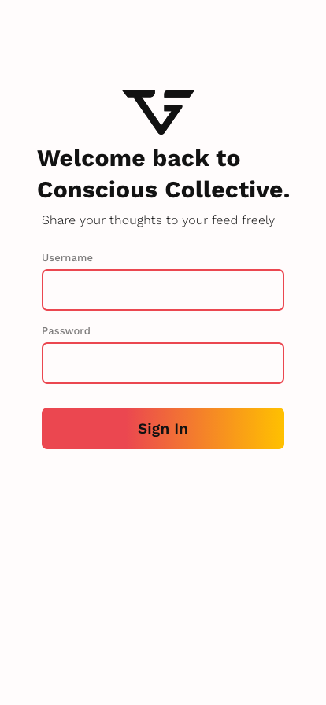
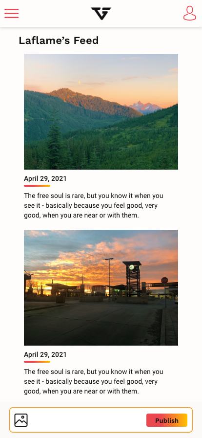

# CM Internship 2021

## Project Examples 
Most of these project examples are personal projects I worked on recently.
### Movie app nominations
This is a movie application built using React, Styled Components &  OMDB API. With this application, a user can search for movies by their titles and pick 5 movies for nomination.

[Live link](https://tifelaflame.github.io/the-shoppies-movie-awards/)
#### Role 
1. UI Design
1. Development

### Yamigo 
Yamigo is an app idea I recently came up with.  Yamigo pairs you up with potential friends in a particular city based on your personality and your interests. This can be achieved by asking the user specific psychological questions or doing a quick personality test for the user. 
We live in a time where meaningful friendships have become  so invaluable and almost priceless. With globalization happening worldwide, people in their mid-twenties to early-thirties will always go to new cities and they will definitely be looking to make worthwhile connections with like-minded people. You might say, there's social media, there's facebook, there's MeetUp, there's Bumble Friends, there are friendship apps but if I were to ask people how many lasting connections they've made off these platforms, the value of these platforms dwindle.There are friendship apps out there, but these apps are still kind of a guessing game because it’s quite hard knowing how you and someone would fit.

I believe this is something my business idea can exploit.

#### Role 
1. Idea conceptualization
1. Market research
1. User research 
1. Brand Design
1. UI Design

[Link for sample presentation](https://www.canva.com/design/DAEFT4Agpt0/btATI2ZPvYXvy2-XVErxtQ/edit)
### Mobile news feed 
This is a mobile news feed view of a hypothetical social network built with HTML5, SCSS & JavaScript OOP.

#### Role 
1. UI Design - Adobe XD
1. Web development

## Inspiration

### Kord
This is a streaming site that combines Spotify, Soundcloud and Youtube. It was built with React/Redux/Express/PostgreSQL. Chrome & Firefox browsers supported.

I was inspired  by this project because it was a platform that allowed users to combine playlists from different streaming platforms. The user can also search for music and get results from each of these platforms. 

This project intrigued me, as someone that enjoys creating playlists, friends always ask me to share my playlists with them. Most of my friends use either Apple Music, Deezer or Youtube Music, as a Spotify die hard fan, sharing playlists I made for them was challenging. I've always imagined building a platform that allows me upload a Spotify playlist link and export an Apple, Tidal or Youtube Music playlist link I can share with friends. 

### NFTs 
 A non-fungible token is a digital record that is on the blockchain ledger. NFT confirms ownership of a certain digital object. With NFT technology, developers will be able to get rid of the problem of safeguarding ownership of digital items. 

 Everyone that has ownership rights to a particular object knows that it is the authentic one they have since information about this is safely stored in the blockchain.

 I was inspired by this technology because it gives digital creators the autonomy of presenting their work on their own.

### VSCode Stories Extension
This extension lets you share code snippers with other developers. I found this inspiring because it was a thought that a developer recently had and decided to build. I'm always intrigued by how an idea can be coded into reality even when there are obstacles. This extension was sold a month later. It was built with TypeScript, PostgreSQL & NPM packages. 

## Focus during internship
With the time and resources to learn and build anything, I will love to spend my time in the experience design and technology departments.

The BMW BYO project is an example of a real life client project I will like to work on during this internship. 

I want to focus my efforts on learning and developing unique digital experiences for brands. Also, I will like to go through the entire process of taking a client's project from research to development stage.  Finally, it will be great if I'm paired up with a mentor in both the design and technology departments.

CM has worked with the world's best brands, it will be a privilege to collaborate and work with professionals that have been involved in these projects.

## Code challenge solution
[Link for solution](https://codesandbox.io/s/2021-internship-exercise-menu-forked-k0m87?file=/src/index.js)